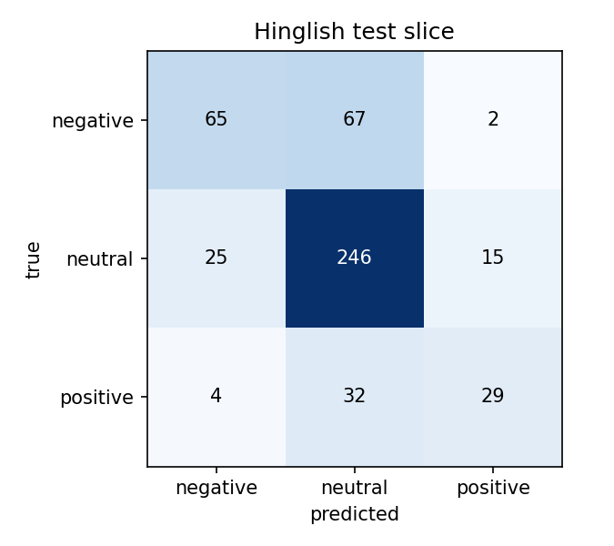

# Hinglish Sentiment Classification

Fine-tuned **mBERT** and **MuRIL** for 3-class sentiment (negative / neutral / positive) on a mix of English and
Hinglish (romanized Hindi mixed with English), and compared them against a TF-IDF + Logistic Regression baseline.
The focus is on how the models do on the **Hinglish subset**, not just the overall score.

- **Model:** [Shrishti03/hinglish-sentiment-muril](https://huggingface.co/Shrishti03/hinglish-sentiment-muril)
- **Demo:** coming soon (Hugging Face Space)

## Results

Macro F1 on the test set (8,538 rows; 485 of them Hinglish).

| Model | Overall | Hinglish | English |
|---|---|---|---|
| TF-IDF + Logistic Regression | 0.817 | 0.518 | 0.826 |
| mBERT (3 epochs) | 0.847 | 0.630 | 0.855 |
| MuRIL (2 epochs) | 0.847 | 0.624 | 0.856 |

- Both fine-tuned models improve Hinglish Macro F1 by about 10-11 points over the baseline.
- mBERT and MuRIL are effectively tied. With 485 Hinglish test rows, a 0.006 difference is noise.
- Macro F1 is used instead of accuracy because the classes are uneven, especially on Hinglish (about 59% neutral).

## Error analysis (MuRIL, Hinglish test slice)



| Class | Recall |
|---|---|
| Negative | 0.49 |
| Neutral | 0.86 |
| Positive | 0.45 |

- **The model plays it safe.** It predicts neutral for 71% of Hinglish rows, but only 59% are truly neutral.
  99 of its 145 errors (68%) are a negative or positive tweet labeled neutral.
- **It rarely flips sentiment.** Only 6 of 145 errors are negative vs positive.
- **Slang and abuse in romanized Hindi** is where negatives get missed. Hinglish is only about 5% of the training data,
  so the model has seen little of it.
- **Length does not explain the errors.** Accuracy is about 0.70 for tweets of 11+ words.
- **Labels look inconsistent in places** (from reading samples of the errors): some congratulation messages are labeled
  neutral, and some critical or abusive tweets are labeled neutral. Part of the gap may be label noise.
- **Many tweets are cut off** in the source data (they end in "..."), so some sentiment may be missing.

These patterns come from reading a sample of errors, not all of them.

## Dataset

[`airzipm/sentiment-dataset-en-hi-hinglish-v2`](https://huggingface.co/datasets/airzipm/sentiment-dataset-en-hi-hinglish-v2):
about 114K rows (train 96.7K / validation 8.5K / test 8.5K). Labels: 0 = negative, 1 = neutral, 2 = positive.

- It is several datasets merged: movie snippets, IMDB and Yelp reviews, English tweets and Hinglish tweets.
- About 5% of rows are Hinglish. They are tagged with a simple rule: 2 or more common romanized Hindi/Urdu words, or any
  Devanagari characters. A manual check of 20 tagged and 20 untagged rows looked right, but it is a heuristic.
- Hinglish rows are almost all tweets, while English rows are mostly reviews. So the "Hinglish" score really means
  "Hinglish tweets".
- Hinglish is more neutral-heavy than English: 58% neutral, 27% negative, 15% positive (English is roughly 36 / 36 / 28).

## Method

- **Cleaning:** fix escaped characters, remove mentions and links (including broken `t.co` links), lowercase.
- **Baseline:** TF-IDF (1-2 grams, 100K features) + Logistic Regression with balanced class weights.
- **Fine-tuning:** `bert-base-multilingual-cased` and `google/muril-base-cased` with Hugging Face `Trainer`.
  Learning rate 2e-5, batch size 32 per GPU on 2x T4, max length 128, mixed precision. The best epoch is picked by
  validation Macro F1, and the test set is scored once at the end.
- The MuRIL run uses seed 42 and 2 epochs (validation was already at its best by epoch 2). The mBERT numbers are from an
  earlier 3-epoch run before the code was moved into `src/`, so the two runs are not perfectly matched.

## Repo layout

```
notebooks/
  01_eda_baseline.ipynb     data, Hinglish tagging, TF-IDF baseline
  02_finetune.ipynb         fine-tune MuRIL / mBERT, results table
  03_error_analysis.ipynb   confusion matrix, example mistakes
src/
  preprocess.py             clean_text, is_hinglish
  data.py                   load + clean + tag the dataset
  train.py                  run(): fine-tune, evaluate, save, push to Hub
results/                    metrics and plots
```

## How to run

```bash
pip install -r requirements.txt
```
Run the notebooks in order. Fine-tuning needs a GPU (it was done on Kaggle, 2x T4, about 50 minutes for 2 epochs).
Model weights are not stored in this repo. They are on the Hugging Face Hub.

## Limitations

- The Hinglish test slice is small (485 rows, 65 positive), so small score differences are noise.
- Hinglish tagging is a word-list heuristic, and Hinglish here means tweets only.
- Some labels look noisy, and some tweets are truncated.
- Texts are cut at 128 tokens, which truncates long reviews.

## Ideas for next steps

Oversample or add more Hinglish data, use class weights, tune the neutral decision threshold on the validation set,
and hand-check a set of errors to measure how much of the gap is label noise.
